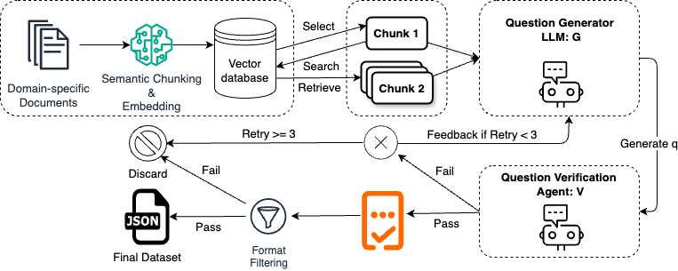

# VERGE: Verification-Enhanced Generation of Multi-Hop Datasets for Evaluating Task-Specific RAG

<p align="center">
<a href="...">VERGE Paper</a>
</p>

<p align="center">
  
  <br>
  <b>Figure</b>: VERGE dataset generation process
</p>

## Overview

This repository contains the implementation of VERGE, a verification-enhanced methodology for generating multi-hop datasets to evaluate Retrieval-Augmented Generation (RAG) systems. VERGE addresses significant methodological gaps in existing RAG evaluation frameworks by generating task-specific, multi-hop reasoning dataset.

## 🌟 Key Features

- **VERGE**: Implements a novel verification agent that ensures generated questions necessitate genuine multi-hop reasoning and maintain factual consistency
- **Hierarchical Error Taxonomy**: Provides structured analysis of RAG system failure patterns specifically in multi-hop reasoning contexts

## Repository Structure

- `Chunker/`: Scripts for chunking documents
- `Data/`: Scripts for downloading the datasets
- `ExamProcesser`: Scripts for generated exam processor
- `Solver`: Scripts for solving the generated exams
- `categorise_errors.py`: Scripts for categorise the error type
- `generate_exam`: Scripts for generating an exam
- `prompt_templates.py`: Prompting templates for question generation, verification, and evaluation
- `retriever.py`: Retriever class

## 🚀 Quick Start

### Installation

```bash
pip install -r requirements.txt
```

### Usage

#### Download data

```bash
python src/Data/long_bench_downloader.py
python src/Data/download_documents_sec_filings.py
```

#### Chunk, Embed and Store the data

```bash
python src/Chunker/document_chunker.py
```

#### Generate Multi-hop Datasets with Verification Agent

```bash
python src/generate_exam.py
```

#### Solve the exam

```bash
python src/Solver/solve_exam_rag.py
```

#### Categorise Error Patterns

```bash
python src/categorise_errors.py
```

## License

[MIT License](LICENSE)