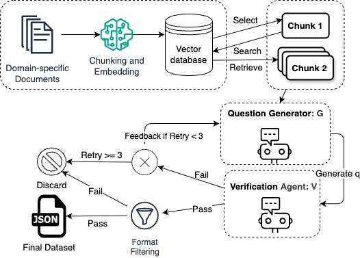

# VERGE: Verification-Enhanced Generation of Multi-Hop Datasets for Evaluating Task-Specific RAG

<p align="center">
<a href="#">VERGE Paper (link will be added upon acceptance)</a>
</p>

<p align="center">
  
  <br>
  <b>Figure</b>: VERGE dataset generation process
</p>

## Overview

This repository contains the implementation of VERGE, a verification-enhanced methodology for generating multi-hop datasets to evaluate Retrieval-Augmented Generation (RAG) systems. VERGE addresses significant methodological gaps in existing RAG evaluation frameworks by generating task-specific, multi-hop reasoning datasets.

## Key Features

- **Verification Agent**: Ensures generated questions necessitate genuine multi-hop reasoning and maintain factual consistency
- **Hierarchical Error Taxonomy**: Structured analysis of RAG system failure patterns specifically in multi-hop reasoning contexts

## Repository Structure

```
src/
├── Chunker/                  # Document chunking scripts
├── Data/                     # Dataset download scripts
├── ExamProcesser/            # Post-generation exam processing
├── LLMServer/                # Local LLM inference wrappers (llama.cpp)
├── Solver/                   # RAG and closed-book exam solvers
├── categorise_errors.py      # Error pattern categorisation
├── generate_exam.py          # Main dataset generation pipeline
├── prompt_template.py        # Prompt templates for generation, verification, and evaluation
└── retriever.py              # Hybrid BM25 + dense retriever
```

## Requirements

- Python 3.10+
- GPU recommended for local model inference (llama.cpp supports CPU-only at reduced speed)

## Quick Start

### Installation

```bash
pip install -r requirements.txt
python -m spacy download en_core_web_sm
python -m nltk.downloader punkt_tab
```

### Setting up the Python path

All scripts should be run from the project root with `src/` on the Python path:

```bash
export PYTHONPATH=src
```

### 1. Download data

```bash
python src/Data/long_bench_downloader.py
python src/Data/download_documents_sec_filings.py
```

### 2. Chunk, embed and index the data

```bash
python src/Chunker/document_chunker.py
```

### 3. Generate multi-hop datasets with the verification agent

```bash
python src/generate_exam.py \
  --task_domain gov_report \
  --model_name llama_3_2_3b \
  --sample_size 700 \
  --target_hop_number 176 \
  --version v1
```

Supported `--model_name` values: `llama_3_2_3b`, `llama_3_1_8b`, `gemma2_9b`, `ministral_8b`, `mistral_7b`

Supported `--task_domain` values: `gov_report`, `hotpotqa`, `multifieldqa_en`, `SecFilings`, `wiki`

### 4. Solve the exam (RAG setting)

```bash
python src/Solver/solve_exam_rag.py
```

### 5. Categorise error patterns

```bash
python src/categorise_errors.py
```

## License

[MIT License](LICENSE)
